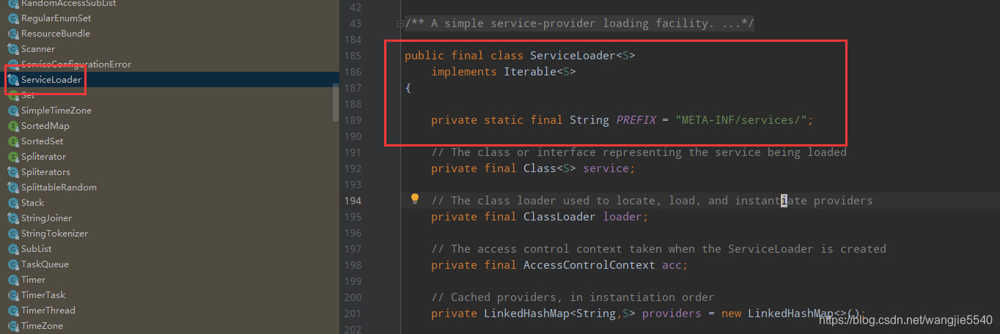
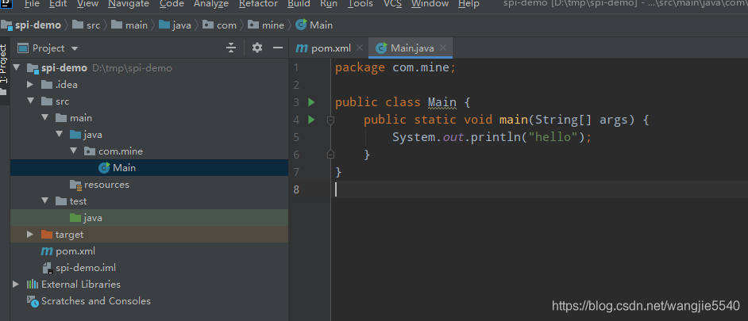
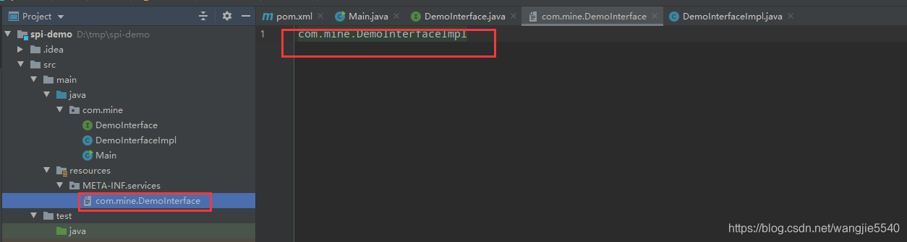
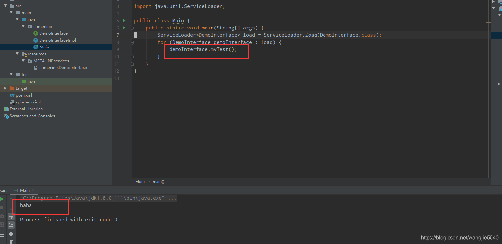

> **參考文章：**
> - [java-spi编程实践](https://blog.csdn.net/wangjie5540/article/details/105342462 "java-spi编程实践")

# spi 机制
- spi 机制的目标：实现接口与实现的解耦。

- spi 机制在开源项目中的应用：
  - spring 中大量使用（ioc的过程会自动选取一个实现）
  - 数据库驱动加载
  - dubbo等等

| 简单的理解：spi 技术就是 jdk 提供的一种 callback 技术（通过 ServiceLoader 类），大家都按照这个规范走，jdk 自然会老老实实干活



# spi 简易 demo
### 创建一个 maven 项目



pom 文件如下

```xml
<?xml version="1.0" encoding="UTF-8"?>
<project xmlns="http://maven.apache.org/POM/4.0.0"
         xmlns:xsi="http://www.w3.org/2001/XMLSchema-instance"
         xsi:schemaLocation="http://maven.apache.org/POM/4.0.0 http://maven.apache.org/xsd/maven-4.0.0.xsd">
    <modelVersion>4.0.0</modelVersion>

    <groupId>com.mine</groupId>
    <artifactId>spi-demo</artifactId>
    <version>1.0-SNAPSHOT</version>
    <properties>
        <java.version>1.8</java.version>
        <mapstruct.version>1.3.1.Final</mapstruct.version>
        <project.build.sourceEncoding>UTF-8</project.build.sourceEncoding>
    </properties>
    <build>
        <plugins>
            <plugin>
                <artifactId>maven-compiler-plugin</artifactId>
                <version>2.5.1</version>
                <configuration>
                    <source>1.8</source>
                    <target>1.8</target>
                    <compilerArgument>-proc:none</compilerArgument>
                </configuration>
            </plugin>
        </plugins>
    </build>
</project>
```

### 创建普通的接口和实现

DemoInterface.java

```java
package com.mine;

public interface DemoInterface {
    void myTest();
}
```

DemoInterfaceImpl.java

```java
package com.mine;

public class DemoInterfaceImpl implements DemoInterface {
    @Override
    public void myTest() {
        System.out.println("haha");
    }
}
```

### 编写spi


1. 添加 `resources/META-INF/services/com.mine.DemoInterface`
2. 文件内容是 impl 的类名：`com.mine.DemoInterfaceImpl`


### 在main中实现调用
```java
public class Main {
    public static void main(String[] args) {
        ServiceLoader<DemoInterface> load = ServiceLoader.load(DemoInterface.class);
        for (DemoInterface demoInterface : load) {
            demoInterface.myTest();
        }
    }
}
```

运行结果如下

